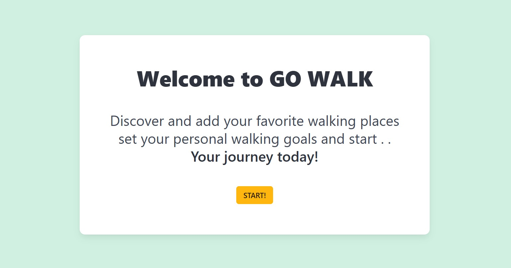
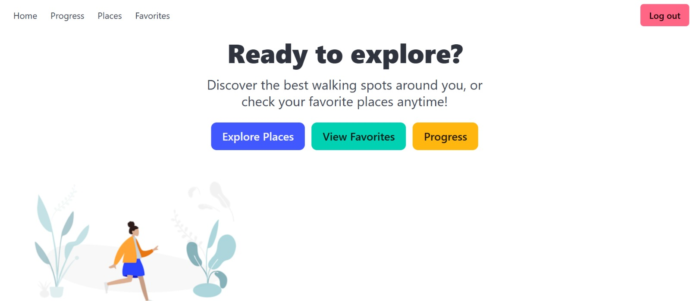
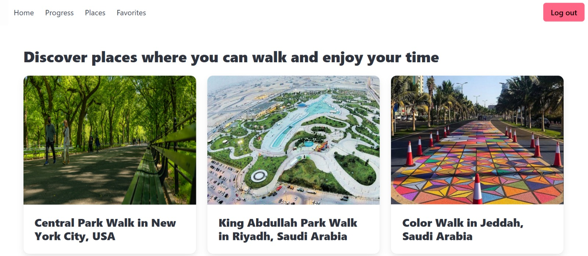
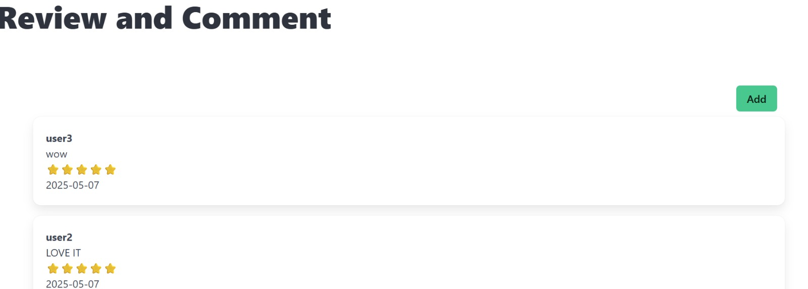

# GO WALK – Discover the Best Walkways & Track Your Progress
##  Project Brief

GO WALK is a full-stack web application designed to help users discover, review, and add their favorite walking places . 
The platform allows users to explore detailed information about walkways, including location, photos, descriptions, and user reviews also users can set their daily step goals and track their progress over time.

## Description
The GO WALK frontend is a responsive React application providing user-friendly interfaces that simplify the website experience. The frontend is integrated with the **backend (Django Rest Framework)** to allow users to log in, create new accounts, discover walking places, and view reviews and comments. Users can also add their own comments and mark their favorite places, which remain private and are not visible to others. Additionally, users can set daily walking goals, edit them, update their progress, and view their progress history.
 
 ### Technologies used
 1. React.js
 2. Axios
 3. React Router
 4. Bulma CSS
 5. React Toastify

### Backend Repository
https://git.generalassemb.ly/aseelma12/backend

## Installation Instructions

To run the project, you need to clone both the backend and frontend repositories. Below are the steps for setting up the frontend:

1. Clone the repo:
-  `git clone https://git.generalassemb.ly/aseelma12/frontend.git`

2.  To the project directory
- `cd frontend`

3. Install dependencies
- `npm install`

4. Run the Reat development server
- `npm run dev`

## Screenshots 
### Welcom Page 

### Home Page 

### Wallway Places Page 

### Review and comment Page 

## IceBox Features
- Allow users to share their favorite places publicly with other users. 
- Rewards system that grants badges or points when users successfully reach their daily step goals.

